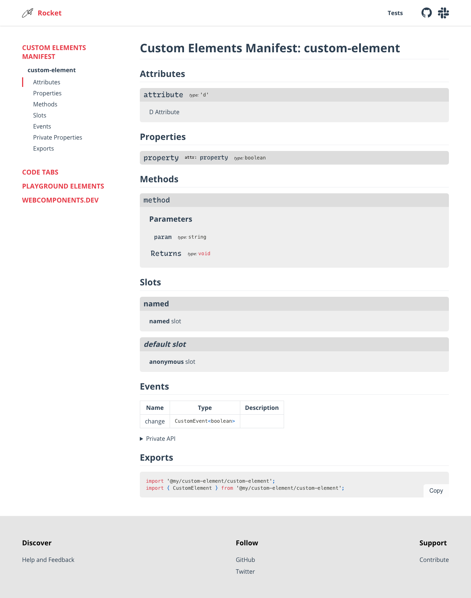

# rocket-preset-custom-elements-manifest

Documents code generation for JavaScript libraries, particularly custom elements.

## Configuration

Add the preset to your `rocket.config.js`, and configure it with a collections object. `collections` is a record of collection names to tab types. For example, if you want code tabs which switch between install commands for `npm`, `yarn`, and `pnpm`, add the following:

```js
import { customElementsManifest } from 'rocket-preset-custom-elements-manifest';

export default {
  presets: [
    customElementsManifest()
  ]
}
```

### Options

| Option          | Type      | Description | Default |
| --------------- | --------- | ----------- | ------- |
| typeLinks       | `object`  | Object mapping from type name to URL | |
| typeLinksNewTab | `boolean` | Whether to open type links in a new tab | |
| root            | `string`  | Absolute path to glob from | The path above the `node_modules` dir the preset is in |
| package         | `string`  | relative path (with or without leading `./`) to a single package.json file. Takes precedence over `packages` | |
| packages        | `string`  | glob pattern for multiple package.json files | `'packages/*/package.json'` |
| imports         | `object`  | Options for rendering imports | `{ keepExtension: false }` |

## Usage

Because every package is different, this preset does not _create_ docs pages for you, but it does _fill_ the docs pages you create with API documentation.

### Documenting packages

API pages document package indexes or their modules. To add a page to your documentation, create a markdown file with the `layout-api` or `layou-api-index` layout, a `package` field, and a `module` or `modules` field

`docs/api/my/index.md`

~~~markdown
---
layout: layout-api-index
package: '@my/custom-element'
module: index.js
---

# Custom Elements Manifest

This page documents the `index.js` file in `@my/custom-element`
~~~

`docs/api/my/custom-element/index.md`

~~~markdown
---
layout: layout-api
package: '@my/custom-element'
module: custom-element.js
---

# Custom Elements Manifest >> custom-element

This page documents the `custom-element.js` file in `@my/custom-element`
~~~

### Type Links
If your custom-elements manifest contains type information, and you'd like to link particular types to other pages, pass the `typeLinks` option to the preset. All instances of the keys of the passed object found in type strings will get wrapped in links to the value for that key. For example, to link `HTMLElement` to MDN and `WickedGoodBaseClass` to a local docs page, and to have those links open in a new tab, use the following config:

```js
import { customElementsManifest } from 'rocket-preset-custom-elements-manifest';

export default {
  presets: [
    customElementsManifest({
      typeLinksNewTab: true,
      typeLinks: {
        HTMLElement: 'https://developer.mozilla.org/en-US/docs/Web/API/HTMLElement',
        WickedGoodBaseClass: '/api/lib/base-class/',
      }
    })
  ]
}
```

## Results

With JavaScript enabled, users will be able to pick their preferred 'flavour', which persists across page loads via local storage.



### `<noscript>`

Content is king! Users with JavaScript disabled get a gracefully degraded experience


## Styling

Enjoy consistent site-wide theming by setting `--markdown-syntax-background-color` and `--markdown-table-row-odd-background-color`
